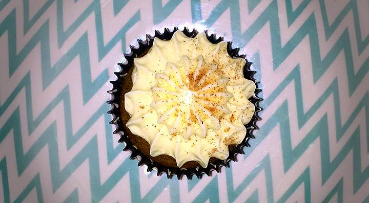

+++
title = "Chai tea cupcakes"
date = 2015-06-21 19:00:00+10:00
+++

Recently, my partner suggested that we try making a chai tea cupcake. After toying with a couple of recipes online to varied success, I decided to try my own take on the cupcake. And... it worked!

<!-- more -->

### Yield

Similarly to my [chocolate cupcake recipe](), this batch makes between 18 - 24 cupcakes, depending on how much you fill the patty.

### Ingredients

- 2 cups plain flour
- 2 cups sugar
- 1 teaspoon bicarb (baking) soda
- 1 cup (250ml / 1 Australian stick) unsalted butter
- 1 cup full cream milk
- 1 1/2 teaspoon ground cardamom
- 1 1/2 teaspoon ground cinnamon
- 1/2 teaspoon ground ginger
- 1/4 teaspoon ground cloves
- 1/4 teaspoon ground nutmeg
- 1/2 cup buttermilk
- 2 eggs
- 1 teaspoon vanilla extract

### Method

1. Pre-heat your oven to 180 degrees celsius
2. Sift flour, sugar and bicarb together into a mixing bowl and set aside
3. In a saucepan over medium heat, melt butter. Using a whisk, add in milk and cardamom, cinnamon, ginger, cloves and nutmeg. Continue whisking until it boils
4. Pour hot chai mix into the flour/sugar mix, stir with wooden spoon until just combined
5. Add buttermilk, eggs and vanilla, stir until liquid is mixed through
6. Using your electric mixer, mix for 2-3 minutes on a medium speed
7. Line your tray with patty pans
8. Pour cupcake mix into pans, filling to 2/3 of the patty.
9. Bake for 25 minutes, or until the cakes spring back when touched on top

**Note:** The consistency of the mix should be quite liquidy. More than store-bought mixes or other recipes. This is absolutely fine.

### Tips

1. **Cream-cheese frosting**

	For an amazing complementary frosting, mix 1/2 stick of cream cheese (philly, of course), 1/2 stick of butter with 1 bag (500 grams) pure icing sugar until completely mixed. When mixed, add 2-3 tablespoons of lemon juice until the mixture has a slight lemon tangy taste.

	Pipe generously on top of cool cupcakes, and sprinkle with cinnamon sugar to finish.