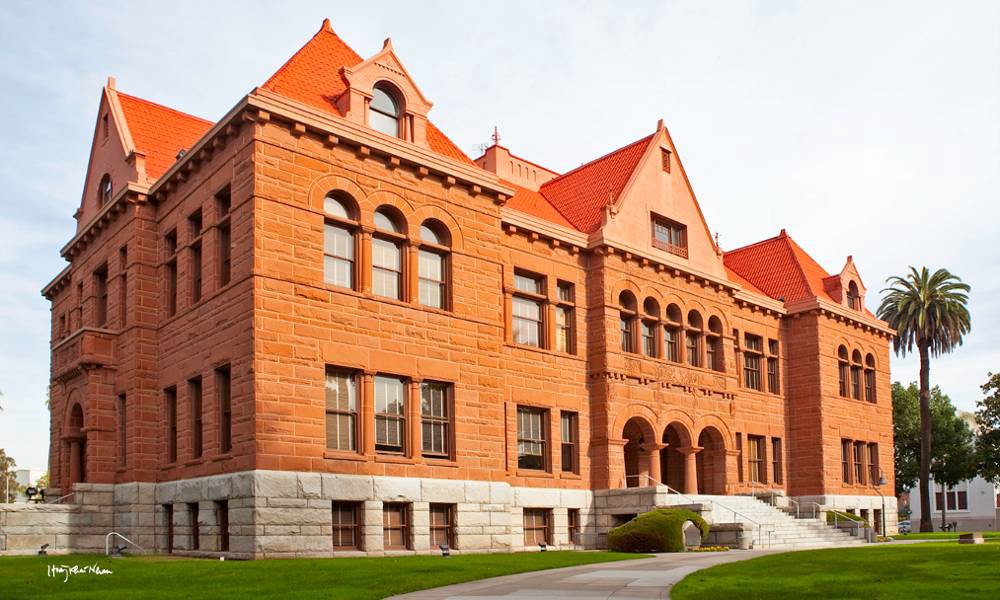
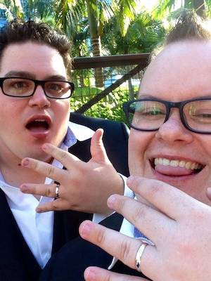

+++
title = "Insta-married™️: How Marriage Equality Impacts Me"
date = 2017-12-09 09:00:00+10:00
+++

> Note: This is a re-post from an article I published at work on December 9, 2017, the day after marriage equality passed the Australian parliament.

<!-- more -->

In 2009 I met a man. It was an interesting time for me, I’d just moved to Melbourne for a job, and had left behind my entire family and social network. We caught up a few times, but because of some personal drama, nothing much came of it until May of the following year.

In 2010, we finally started properly dating (literally, I made him “ask me out” — or as the kids say these days “DTR”). By July, we were seeing each other nearly every day, and by December, he was living with me. Compared to other relationships I’d been in, this was different. We moved faster — we just clicked together. Our friends became our friends. Our families got along. We just worked.

In February 2011, we signed a lease together and began making life plans as a couple. It’s amusing now to think of this as making plans together, because at that point, “plans” involved adopting a cat together and saving for a holiday to Japan.

In May that same year, for our one year anniversary, I surprised him with a holiday to Bali — because my quaint Perth upbringing had lead me to believe that it was the height of …romantic destinations? — and he surprised me with a ring. All said, it wasn’t that much of a surprise — we’d talked about marriage and were both interested, and he had been dropping hints in the weeks leading up, but it still made me cry when it happened. (As far as I remember, it was maybe the first time as an adult that I’d cried.) (Also, I said yes.)

A couple of years passed. I became more and more involved in the Marriage Equality movement, and got increasingly frustrated with the lack of momentum from our country’s leadership. Eventually in 2013, while on holiday in Fiji — sitting in a pool — we decided that enough was enough, and that we should just get it done.

When we were considering where to get married, the easy choice was New Zealand, as they had just achieved marriage equality. The more we thought about it though, we realised that if we couldn’t get married at home, that we should do it somewhere that we love. A place where we had a story to tell from it. Somewhere that we would’ve considered doing a destination wedding at anyway. Sorry, New Zealand. I still ❤ you, but it wasn’t you.

<figure>
  
  <figcaption>The Old Orange County Courthouse, Santa Ana, California.</figcaption>
</figure>

We decided on having our ceremony in the States’, in Southern California. At this point, we’d had several holidays there, both of us being extreme Disney-nerds, and also were considering moving and living there at that point too. Disney weddings were way out of our price range, so we found this gorgeous place in Santa Ana — an old, heritage listed, court house.

We booked the venue, and sent our invites. We found a restaurant nearby for a reception. Honeymoon plans quickly fell into place, too. Everything seemed like the wedding I’d always been told you planned.

Our guest list included 80 people, most from Australia, but some from USA, Canada, Mexico, the Middle East, Thailand and parts of Europe. We knew it was a big ask for people to come, and that our actual guest list would be much lower.

Very quickly, the dialogue with my family got nasty. I try not to think about it, but if I’m being honest, it’s probably the catalyst of the issues why I don’t associate much with them anymore. On my partner’s side, his mum and brother both instantly and enthusiastically RSVP’ed yes. In fact, upon finding out we’d just booked the trip to get married, while we were still in the travel agent’s office, his mum phoned and asked to speak to our travel agent and immediately booked alongside us. The difference in how it was handled by our families is quite stark.

Several of our friends from Australia RSVPed, but most couldn’t make it because of the cost. One by one, friends from overseas bowed out too. By February, we had confirmed 14 guests, plus ourselves. So 16 in total. Despite being disappointed about my family, I was happy with the numbers. Friends of ours from Canada and the US east coast had confirmed, and made perfect sense to be our witnesses. Honestly, the only thing important to me was that he was there. We knew that we could do this alone if we needed to.

<figure class="floated-left">
  
  <figcaption>Us, about 20 mins after getting married</figcaption>
</figure>

On March 20, 2014, we were married at the Old Orange County Courthouse in Santa Ana, California. The ceremony was quirky, and our celebrant was a short, Mexican-American man who was barely taller than the podium, but it was perfect. Reading my vows was also the second time I’ve ever cried as an adult.

A week later, we exited the United States, and returned to “College Roommate mode” in the eyes of our home country. Returning home to a lesser status was probably the most heartbreaking thing I’ve ever had to endure. We could go on holidays and re-gain our recognition as a married couple, but in our everyday lives, we were just cohabitants.

It’s a little known fact that when you get married overseas, you need to provide a government document called a Certificate of No Impediment to marriage, or CNI. Australia readily supplied one to us, because we were not actually married, but on our honeymoon, we hatched a plan to abuse this and get married in every country that would allow us on holidays, and to make a scrapbook of the wedding certificates, ultimately — and finally — ending with one from Australia. My inner anarchist extends only to ideas, and not actual action, so we never actually did this.

I wish I could say that we were the organised type, who immediately got wills and completed stat decs in order to have some sense of legal recognition as a couple, but we didn’t. Every time we made plans to do some of this paperwork, the whole thing became overwhelming and we didn’t do anything. The marriage equality cause became a giant burden on me. A shining light that would solve all of my problems. As I’m sure my Facebook friends would attest, I focused way too much energy on the cause.

When the possibility of actually achieving equality became more and more real, we started talking about what we would do once it was legal. Friends asked us, would we have another ceremony? Would we at least throw a party?

We didn’t want to undermine — or disrespect — the ceremony that we’d had 3 years ago. But we also just wanted to get it out of the way and move on.

When you get married in Australia, you get a free change of name operation, and this extends out to other documentation, too. When you get married overseas, you not only have to complete documentation with Births, Deaths and Marriages of the wedding abroad, but you have to pay for name changes. And then you pay VicRoads, and then you pay basically every other government identity provider also for this. Pragmatically, we settled on the idea of assessing the costs of changing all of our identities in a piecemeal way to our new surname (Marley-Jarrett), and weighing up the cost of remarrying in Australia. If the re-marriage had to happen, it would be a quiet ceremony, with only our required witnesses, and, unlike our Californian wedding, the certificate would be filed away and used only to achieve the initial change of name. No party.

Honestly, the revelation this week that we would get automatic recognition (Insta-married….tm) kind of took me aside. It was up there with that overwhelming feeling from before. I first heard about it on Slack at work, and stared blankly at the screen for about 15 minutes (don’t tell my employer). It helps make the choice for the dilemma mentioned above.

Above all, it means that this week, I might wake up, next to the man I love… married 4 years ago.
